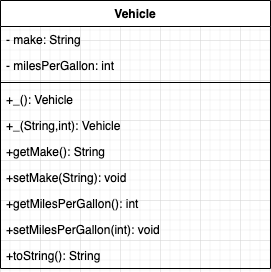
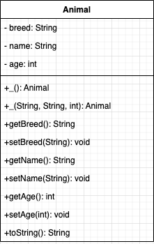
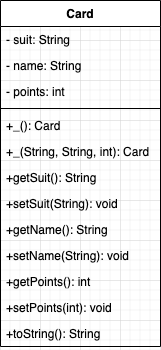
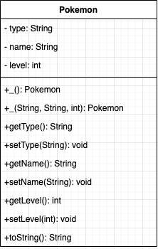
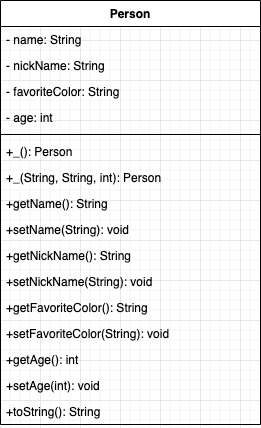
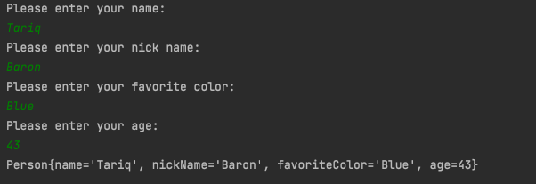

# Lab 03a: Classes, Objects, and Methods

The lecture today was on:

* **Classes** - which are the instructions that tell java how to create a object of that type.
* **Objects** - the unique instance of the class. You can have 2 cars of the same make, model, and type, but each car is unique. What happens to one car doesn't affect the other.
* **Methods** - these are the functions that belong to the objects. Commonly refered to as behaviors.

Below is an example of **UML**, short for Unified Modeling Language, is a standardized modeling the sturcture of objects.




Here is an example of the Java Class for this object.

```
public class Vehicle {
    private String make;
    private int milesPerGallon;

    public Vehicle(){
        make = "";
        milesPerGallon = 0;
    }

    public Vehicle(String m, int mpg){
        make = m;
        milesPerGallon = mpg;
    }

    public String getMake() {
        return make;
    }

    public void setMake(String make) {
        this.make = make;
    }

    public int getMilesPerGallon() {
        return milesPerGallon;
    }
    public void setMilesPerGallon(int milesPerGallon) {
        this.milesPerGallon = milesPerGallon;
    }

    @Override
    public String toString() {
        return "Vehicle{" +
                "make='" + make + '\'' +
                ", milesPerGallon=" + milesPerGallon +
                '}';
    }
}
```

Notice how the UML is a outline of everything that is contained inside of the `Vehicle` class.

## Example and Activity 01
### Step 01 

Take a look at the `Vehicle` and `VehicleTester` classes in the `com.codifferently.labs.lab03a.examples.example01_vehicle`, write all of the comments for the class. Make sure to mark all the constructors, variables, and getter/ setter methods. Then review with classmates or class.

### Step 02

Use the UML Below for `Animal` and complete the `Animal` class in `com.codedifferently.labs.lab03a.activities.activity01` from the UML



### Step 03

In the `AnimalTester` class add the following code. **TYPE IT OUT DO NOT COPY**

```
public static void main(String[] args) {
    Animal animal01 = new Animal("Lion", "Lambert", 10);
    Animal animal02 = new Animal("Dog", "Leroy", 5);
    Animal animal03 = new Animal();
    System.out.println("01 " + animal01.toString());
    System.out.println("02 " + animal02);
    System.out.println("03 " + animal03);
}
```

If you did everything correctly you should see the following output:

```
01 Animal{breed='Lion', name='Lambert', age=10}
02 Animal{breed='Dog', name='Leroy', age=5}
03 Animal{breed='not set', name='not set', age=0}
```

## Example and Activity 02

### Step 01
Take a look at the `Card` and `CardTester` classes in the `com.codifferently.labs.lab03a.examples.example02_card`, write all of the comments for the class. Make sure to mark all the constructors, variables, and getter/ setter methods. Then review with classmates or class.



### Step 02

Use the UML Below for `Pokemon` and complete the `Pokemon` class in `com.codedifferently.labs.lab03a.activities.activity02` from the UML



### Step 03

In the `PokemonTester` class add the following code. **TYPE IT OUT DO NOT COPY**

```
public static void main(String[] args) {
    Pokemon pikachu = new Pokemon("Electric", "Pikachu", 1);
    Pokemon onix = new Pokemon("Rock", "Onix", 2);
    Pokemon noName = new Pokemon();
    System.out.println(pikachu);
    System.out.println(onix);
    System.out.println(noName);
}
```

If you did everything correctly you should see the following output:

```
Pokemon{type='Electric', name='Pikachu', level=1}
Pokemon{type='Rock', name='Onix', level=2}
Pokemon{type='not set', name='not set', level=0}
```

## Lab

Use the `Person` UML to complete and create the `Person` class in `com.codedifferently.labs.lab03a.lab`



Once that is completed , in the `PersonTester` class. You should create a `Scanner` object that prompts the user for their information, and uses that to create the `Person` object:




